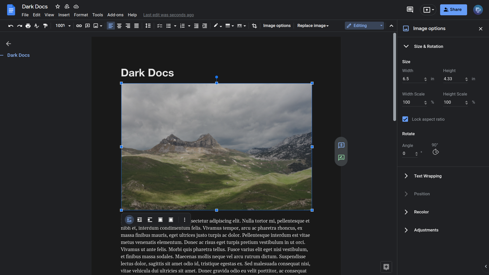

# Dark Docs
A dark theme for Google Docs web, based on the colors used in its mobile app. Subtle animations added. Some elements adjusted for legibility. 

## Installation

### Automatic

Install the theme at [Dark Docs on UserStyles.world](https://userstyles.world/style/2597/dark-docs). 

### Manual 

1. Use a browser extension that applies user CSS themes to webpages, such as [Stylus](https://github.com/openstyles/stylus/).
2. Apply the stylesheets: 
	- [Colors and animations](colors-animations.css) and [Basic elements](basic-elements.css) to URLs starting with `https://docs.google.com/document/d/` and URLs starting with `https://docs.google.com/sharing/driveshare` (both URLs to both stylesheets). 
	- [Special elements](special-elements.css), [Side panels](side-panels.css), and [Other screens](other-screens.css) to URLs starting with `https://docs.google.com/document/d/`. 
	- [Share sheet](share-sheet.css) to URLs starting with `https://docs.google.com/sharing/driveshare`. 

Check the [Customization wiki](https://github.com/winghongchan/dark-docs/wiki/Customization) if you wish to add a wallpaper. 

Dark Docs only works with Google Docs. There are plans to make themes for Google Sheets and Slides in the future. If you create such a project (with a similar intent to this project), you may submit a pull request to include a link to it here.

## Contributing
The intent is simple - to make a dark mode for Google Docs web that shares the same colors and overall look to the Google Docs mobile app in dark mode. Check the [Design Guide wiki](https://github.com/winghongchan/dark-docs/wiki/Design-Guide) for guidance on using the color variables.
